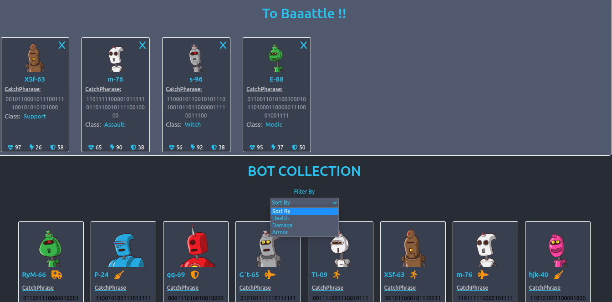

## Bot-Army

### Phase-2: React-week-2-codeCallenge

This repository contains several React components that are part of a larger project related to an exciting bot collection. The components interact with each other to provide users with a captivating bot collection experience. Below, we provide a brief overview of each component and its purpose.

# <ins>Key Features</ins>

#### <li>Mobile Responsive</li>

--- --- --- --- 

#### <li>Click on each bot card</li>

#### <li> View the specs for each bot</li>

#### <li> Delete a bot form the DB</li>

#### <li> Add a bot to your Army</li>

#### <li>Navigate back to collection</li>

#### <li>Remove bot from Army</li>

#### <li>Sort by bot Attributes</li>

## Getting Started

To run the React App on your local machine, follow these steps:

1. Clone the repository: git clone https://github.com/Bisinle/bot-Army
2. Navigate to the project directory:` cd botania`
3. Install dependencies: `npm install`
4. Navigate to `src/data` to start the server : `json-server --watch ./src/data/botBase.json`
5. Start the development server: `npm start`
6. Open your browser and go to `http://localhost:3000 `to view the app.

# Contact

For any further questions or inquiries, please contact abdiwadud.mohamedd.@gmail.com.

# License

This code is developed by `Abdiwadud Mohamed` and is under the `Bisinle` License.
